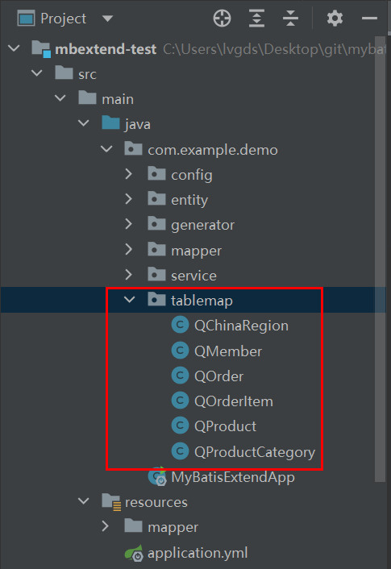

# 一、简介

基于mybatis写的扩展，通过链式接口来构建sql语句，免于手写sql语句。代码量不多，实现简单，会java就行，因此自个维护不难；

# 二、安装

1、`install mbextend` 项目

2、引入 `mbextend` 项目依赖

# 三、生成表映射类

将下边的类复制到项目内，填写`entityPath`、`sourcePath`、`outPutDirName`三个类属性值。

```java
import com.baomidou.mybatisplus.annotation.TableField;
import com.baomidou.mybatisplus.annotation.TableName;
import com.baomidou.mybatisplus.core.toolkit.StringUtils;
import com.mbextend.BaseSqlProvider;

import java.io.*;
import java.lang.reflect.Field;
import java.lang.reflect.Modifier;
import java.nio.charset.StandardCharsets;
import java.util.ArrayList;
import java.util.Arrays;
import java.util.List;
import java.util.Scanner;
import java.util.stream.Collectors;

/**
 * 生成表映射类
 * @author lvqi
 * @version 1.0.0
 * @since 2022/1/20 16:49
 */
public class TableMapGenerator {
    // 实体类路径
    private static final String entityPath = "com/example/demo/entity";
    // 源码路径
    private static final String sourcePath = "src/main/java/";
    // 项目构建输出路径名
    private static final String outPutDirName = "target";

    public static void main(String[] args){
        String entityPackage = entityPath.replaceAll("/",".");
        // 要生成标记类的实体类对象
        List<Class<?>> entityClasses = Arrays.stream(scanner("表名，多个英文逗号分割")
                .split(",")).map(entity -> {
            String entityName = entityPackage + "." + entity;
            try {
                return Class.forName(entityName);
            } catch (ClassNotFoundException e) {
                throw new RuntimeException(String.format("实体类%s不存在", entityName));
            }
        }).collect(Collectors.toList());

        String tableMapPackage = entityPackage.substring(0,entityPackage.lastIndexOf("."))+"."+"tablemap";
        String path = Class.class.getResource("/").getPath();
        String projectPath = path.substring(1, path.lastIndexOf(outPutDirName));
        String generatePath = projectPath + sourcePath + entityPath.substring(0,entityPath.lastIndexOf("/"))+"/tablemap";
        File directory = new File(generatePath);

        if(!directory.exists()){
            directory.mkdir();
        }
        // 生成实体类辅助类java文件
        for (Class<?> tClass : entityClasses) {
            String tableName;
            TableName tableNameAnno = tClass.getAnnotation(TableName.class);
            if(tableNameAnno==null || tableNameAnno.value().equals("")){
                tableName = camelConvert(tClass.getSimpleName());
            }else{
                tableName = tableNameAnno.value();
                if(!tableName.startsWith("`")){
                    tableName = "`"+tableName+"`";
                }
            }
            String markTemplate;

            List<String> lines = getTemplateFile();
            markTemplate = String.join("\n", lines);
            markTemplate = markTemplate.replaceAll("\\$package\\$", tableMapPackage);
            markTemplate = markTemplate.replaceAll("\\$entity\\$", tClass.getSimpleName());
            markTemplate = markTemplate.replaceAll("\\$table\\$", tableName);
            List<String> fieldsDeclare = new ArrayList<>();
            List<String> fieldInits = new ArrayList<>();
            List<String> setTables = new ArrayList<>();
            List<Field> fields = new ArrayList<>(Arrays.asList(tClass.getDeclaredFields()));
            Class<?> superclass = tClass.getSuperclass();
            if(superclass!=null) {
                fields.addAll(Arrays.asList(superclass.getDeclaredFields()));
            }
            List<String> qColumns = new ArrayList<>();
            fields.forEach(f->{
                int modifiers = f.getModifiers();
                if(!Modifier.isStatic(modifiers)) {
                    TableField tableField = f.getAnnotation(TableField.class);
                    if (tableField == null || tableField.exist()) {
                        String column;
                        if (tableField != null && !tableField.value().equals("")) {
                            column = tableField.value().toLowerCase();
                        } else {
                            column = camelConvert(f.getName());
                        }
                        fieldsDeclare.add(String.format("public final QColumn %s;", f.getName()));
                        fieldInits.add(String.format("this.%s = new QColumn(\"%s\",columnPrefix==null?null:columnPrefix+\"%s\");",
                                f.getName(), column.startsWith("`")?column:("`"+column+"`"), column));
                        setTables.add(String.format("this.%s.setTable(this);",f.getName()));
                        qColumns.add(f.getName());
                    }
                }
            });
            markTemplate = markTemplate.replaceAll("\\$fieldsDeclare\\$", String.join("\n\t",fieldsDeclare));
            markTemplate = markTemplate.replaceAll("\\$fieldInits\\$", String.join("\n\t\t",fieldInits));
            markTemplate = markTemplate.replaceAll("\\$setTables\\$", String.join("\n\t\t",setTables));
            markTemplate = markTemplate.replaceAll("\\$sqlColumns\\$", String.join(",",qColumns));

            File javaFile = new File(directory.getAbsolutePath()+"/Q"+tClass.getSimpleName()+".java");
            try (FileWriter writer = new FileWriter(javaFile)) {
                writer.write(markTemplate);
            } catch (IOException e) {
                throw new RuntimeException(javaFile.getAbsolutePath()+"文件写入失败", e);
            }
        }
    }

    /**
     * 首字母变小写，其余大写字母变成下划线加小写，如：UserName -> user_name
     */
    private static String camelConvert(String targetStr){
        char[] chars = targetStr.toCharArray();
        for (int i = 0; i < chars.length; i++) {
            if(Character.isUpperCase(chars[i])){
                targetStr = targetStr.replaceFirst(Character.toString(chars[i]),
                        (i == 0 ? "" : "_") + Character.toLowerCase(chars[i]));
            }
        }
        return targetStr;
    }

    /**
     * 读取控制台内容
     */
    public static String scanner(String tip) {
        Scanner scanner = new Scanner(System.in);
        System.out.println("请输入" + tip + "：");
        if (scanner.hasNext()) {
            String ipt = scanner.next();
            if (StringUtils.isNotBlank(ipt)) {
                return ipt;
            }
        }
        throw new RuntimeException("请输入正确的" + tip + "！");
    }

    /**
     * 读取jar包内的模板文件
     */
    private static List<String> getTemplateFile(){
        InputStream resource = BaseSqlProvider.class.getClassLoader()
                .getResourceAsStream("MarkTemplate.txt");
        try {
            assert resource != null;
            try(BufferedReader reader = new BufferedReader(
                    new InputStreamReader(resource,StandardCharsets.UTF_8))) {
                return reader.lines().collect(Collectors.toList());
            }
        } catch (IOException e) {
            throw new RuntimeException("模板文件读取失败");
        }
    }
}
```

执行`main`方法，输入实体类名：


回车执行完后，将在实体类包同级包下看到名为`tablemap`的包，里面包含了对应实体的表映射类。



# 四、复制粘贴mapper方法

将下列方法复制到各`Mapper`接口内：

```java
@SelectProvider(type = BaseSqlProvider.class, method = "select")
@ResultMap("BaseResultMap")
List<实体类> select(@Param("sqlQuery") SqlQuery sqlQuery);

@SelectProvider(type = BaseSqlProvider.class, method = "select")
@ResultMap("BaseResultMap")
实体类 selectOne(@Param("sqlQuery") SqlQuery sqlQuery);

@SelectProvider(type = BaseSqlProvider.class, method = "select")
@ResultMap("BaseResultMap")
IPage<实体类> selectPage(IPage<Member> page, @Param("sqlQuery") SqlQuery sqlQuery);

@SelectProvider(type = BaseSqlProvider.class, method = "select")
@ResultType(Boolean.class)
Boolean exists(@Param("sqlQuery") SqlQuery sqlQuery);

@UpdateProvider(type = BaseSqlProvider.class, method = "update")
@ResultType(Integer.class)
Integer update(@Param("sqlUpdate") SqlUpdate sqlUpdate);
```

`@ResultMap`指定的结果映射名需与`XxxMapper.xml`文件内的一至。注意，结果映射内的关联对象需设置别名前缀，避免列名冲突。

```xml
<mapper namespace="com.example.demo.mapper.MemberMapper">

    <!-- 通用查询映射结果 -->
    <resultMap id="BaseResultMap" type="com.example.demo.entity.Member">
        <id column="id" property="id" />
        <result column="username" property="username" />
        <result column="phone" property="phone" />
        <result column="birthday" property="birthday" />
        <result column="gender" property="gender" />
        <result property="money" column="money"/>
        <result property="addressCode" column="address_code"/>
        <result property="addressName" column="address_name"/>
       	<!-- 需设置别名前缀 -->
        <collection property="orders" ofType="com.example.demo.entity.Order" columnPrefix="ord_">
            <id column="id" property="id"/>
            <result column="status" property="status"/>
            <result column="create_time" property="createTime"/>
            <result column="total_price" property="totalPrice"/>
        </collection>
    </resultMap>
</mapper>
```

# 五、使用


## 简单查询：

```java
// 表映射对象
QMember qMember = new QMember();
// 查询member表
SqlQuery sqlQuery = SqlBuilder.query(qMember)
// 省略select方法，则查询所有表的所有字段。select方法可多次调用。
//  .select(qMember)  // 查询member表的所有字段
//  .select(qMember.username, qMember.money)  // 只查询member表的指定字段
    .where(qMember.username.eq("user-0"))
    .build();
Member member = memberMapper.selectOne(sqlQuery);
System.out.println(JSON.toJSONString(member));
```

## between查询：

```java
QMember qMember = new QMember();
SqlQuery sqlQuery = SqlBuilder.query(qMember)
    .where(qMember.birthday.between(
        DateUtil.parse("2008-08-00"),
        DateUtil.parse("2008-09-00")))
    .orderBy(qMember.birthday.orderAsc())
    .build();
List<Member> members = memberMapper.select(sqlQuery);
members.forEach(m-> System.out.println(JSON.toJSONString(m)));
```

## like

```java
QMember qMember = new QMember();
SqlQuery sqlQuery = SqlBuilder.query(qMember)
    // 以什么开关。
    .where(qMember.username.startWith("user-100"))
//  .where(qMember.username.endWith("user-100"))
//  .where(qMember.username.contain("user-100"))
    .build();
List<Member> members = memberMapper.select(sqlQuery);
members.forEach(m-> System.out.println(JSON.toJSONString(m)));
```

## distinct

```java
QMember qMember = new QMember();
SqlQuery sqlQuery = SqlBuilder.query(qMember)
    .select(qMember.gender)
    // 结果集去重
    .distinct()
    .build();
List<Member> members = memberMapper.select(sqlQuery);
members.forEach(m-> System.out.println(JSON.toJSONString(m)));
```

## binary

```java
QMember qMember = new QMember();
SqlQuery sqlQuery = SqlBuilder.query(qMember)
    // 字符串区分大小写
    .where(qMember.username.eq("USER-0").binary())
    .build();
Member member = memberMapper.selectOne(sqlQuery);
System.out.println(JSON.toJSONString(member));
```

## not

```java
QMember qMember = new QMember();
SqlQuery sqlQuery = SqlBuilder.query(qMember)
    // 条件取反
    .where(qMember.username.ne("user-0").not())
    .build();
List<Member> members = memberMapper.select(sqlQuery);
members.forEach(m-> System.out.println(JSON.toJSONString(m)));
```

## 复杂where条件

```java
QMember qMember = new QMember();
SqlQuery sqlQuery = SqlBuilder.query(qMember)
    // 传入where的多个条件以and进行结合，条件间可自由结合成新的条件。
    // eg：cond1.and( cond2.or(cond3) )，解读：cond2与cond3结合成新的条件cond4，cond1再与新的条件cond4结合成新的条件cond5
    .where(qMember.gender.eq("F").or( qMember.gender.eq("M").or(qMember.birthday.eq(new Date())) ),
           qMember.username.eq("user-0"))
    .build();
List<Member> members = memberMapper.select(sqlQuery);
members.forEach(m-> System.out.println(JSON.toJSONString(m)));
```

## Group、Having

```java
QMember qMember = new QMember();
SqlQuery sqlQuery = SqlBuilder.query(qMember)
    .select(qMember.birthday,ExprUtil.count("*"))
    .where(qMember.birthday.between(
        DateUtil.parse("2008-08-00"),
        DateUtil.parse("2008-09-00")))
    // 分组升序
    .groupBy(qMember.birthday.groupAsc())
    // 分组过滤
    .having(qMember.birthday.ne(DateUtil.parse("2008-08-00")))
    .build();
List<Member> members = memberMapper.select(sqlQuery);
members.forEach(m-> System.out.println(JSON.toJSONString(m)));
```

生成的sql语句：

```sql
select t1.`birthday`, count(1) 
from `member` as t1 
where t1.`birthday` between '2008-07-31 00:00:00.0' and '2008-08-31 00:00:00.0' 
group by t1.`birthday` 
having t1.`birthday` !='2008-07-31 00:00:00.0';
```

## exist

```java
QMember qMember = new QMember();
SqlQuery query = SqlBuilder.query(qMember)
    .select(qMember.id)
    .where(qMember.username.eq("user-8"))
    .build();

SqlQuery sqlQuery = SqlBuilder.query(null)
    .select(ExprUtil.ifExpr(ExprUtil.exists(query),true,false))
    .build();

Boolean exists = memberMapper.exists(sqlQuery);
System.out.println(exists);
```

生成的sql语句：

```sql
select if(exists (select t1.`id` from `member` as t1 where t1.`username` ='user-8'),true,false);
```

## 连表查询

```java
QMember qMember = new QMember();
// 指定列别名前缀，需与 MemberMapper.xml 内的Order关联对象的列别名前缀一至
QOrder qOrder = new QOrder("ord_");
SqlQuery sqlQuery = SqlBuilder.query(qMember)
    // 连表查询，注意：join方法要紧随query方法后。
    .innerJoin(qOrder,qMember.id.eq(qOrder.memberId))
    // 查询指定列
    .select(qMember.id,qMember.username,qOrder.id,qOrder.createTime,qOrder.status)
    .where(qMember.username.eq("user-0"))
    .build();
Member member = memberMapper.selectOne(sqlQuery);
if(member!=null && member.getOrders()!=null) {
    member.getOrders().forEach(o -> System.out.println(JSON.toJSONString(o)));
}
```

生成的sql语句：

```sql
select 
t1.`id`, 
t1.`username`, 
t2.`id` as ord_id, 
t2.`create_time` as ord_create_time, 
t2.`status` as ord_status 
from `member` as t1 
inner join `order` as t2 on t1.`id` =t2.`member_id` 
where t1.`username` ='user-0';
```


## 子查询

**示例1：**

```java
QMember qMember = new QMember();
SqlQuery sqlQuery1 = SqlBuilder.query(qMember)
    .select(qMember.id)
    .where(qMember.username.eq("user-1"))
    .build();

QOrder qOrder = new QOrder();
SqlQuery sqlQuery2 = SqlBuilder.query(qOrder)
    .select(qOrder.id, qOrder.createTime,qOrder.status)
    .where(qOrder.memberId.eq(sqlQuery1))
    .build();
List<Order> orders = orderMapper.select(sqlQuery2);
orders.forEach(o -> System.out.println(JSON.toJSONString(o)));
```

生成的sql语句：

```sql
select t1.`id`, t1.`create_time`, t1.`status` 
from `order` as t1 
where t1.`member_id` =(
    select t1.`id` 
    from `member` as t1 
    where t1.`username` ='user-1'
);
```

**示例2：**

```java
QMember qMember = new QMember();
SqlQuery sqlQuery1 = SqlBuilder.query(qMember)
    .select(qMember.id)
    .where(qMember.username.in(Arrays.asList("user-3","user-4")))
    .build();

QOrder qOrder = new QOrder();
SqlQuery sqlQuery2 = SqlBuilder.query(qOrder)
    .select(qOrder.id, qOrder.createTime)
    .where(qOrder.memberId.in(sqlQuery1))
    .build();
List<Order> orders = orderMapper.select(sqlQuery2);
orders.forEach(o -> System.out.println(JSON.toJSONString(o)));
```

生成的sql语句：

```sql
select t1.`id`, t1.`create_time` 
from `order` as t1 
where t1.`member_id` in (
    select t1.`id` 
    from `member` as t1 
    where t1.`username` in ('user-3','user-4')
);
```

**示例3：**

```java
QMember qMember = new QMember();
SqlQuery sqlQuery1 = SqlBuilder.query(qMember)
.select(qMember.id)
.where(qMember.username.in(Arrays.asList("user-3","user-4")))
.build();

QOrder qOrder = new QOrder();
SqlQuery sqlQuery2 = SqlBuilder.query(qOrder)
// join子查询。通过column方法来指定子查询内的查询字段，多层嵌套子查询，也只需将映射表字段作为最外层子查询的column方法的参数即可。
.innerJoin(sqlQuery1,sqlQuery1.column(qMember.id).eq(qOrder.memberId))
.select(qOrder.id, qOrder.createTime)
.build();
List<Order> orders = orderMapper.select(sqlQuery2);
orders.forEach(o -> System.out.println(JSON.toJSONString(o)));
```

生成的sql语句：

```sql
select t1.`id`, t1.`create_time` 
from `order` as t1 
inner join (
    select t1.`id` 
    from `member` as t1 
    where t1.`username` in ('user-3','user-4')
) as t2 on t2.`id` = t1.`member_id`;
```


## union

```java
QMember qMember = new QMember();
SqlQuery sqlQuery1 = SqlBuilder.query(qMember)
    .where(qMember.username.eq("user-5"))
    .build();

SqlQuery sqlQuery2 = SqlBuilder.query(qMember)
    .where(qMember.username.eq("user-6"))
    .build();

List<Member> members = memberMapper.select(sqlQuery1.union(sqlQuery2));
members.forEach(m -> System.out.println(JSON.toJSONString(m)));
```

## 函数

**示例1：**

```java
QMember qMember = new QMember();
SqlQuery sqlQuery = SqlBuilder.query(qMember)
    // 可使用ExprUtil构建各种算术或函数表达式，
    // if(qMember.gender="f","女人","男人")
    .select(ExprUtil.ifExpr(qMember.gender.eq("F"),"女人","男人")
            // 指定别名，可以是字符串别名，也可以是特定列（替代）
            .alias(qMember.gender),qMember.username)
    .where(qMember.username.eq("user-7"))
    .build();
Member member = memberMapper.selectOne(sqlQuery);
System.out.println(JSON.toJSONString(member));
```

生成的sql语句：

```sql
select if(t1.`gender` ='F','女人','男人') as `gender`, 
t1.`username` 
from `member` as t1 
where t1.`username` ='user-7';
```

**示例2：**

```java
QMember qMember = new QMember();
SqlQuery sqlQuery = SqlBuilder.query(qMember)
    // case 表达式
    .select(ExprUtil.caseSwitch(qMember.gender,"F","女人","M","男人","不男不女")
            .alias(qMember.gender),qMember.username)
    .page(2,5)
    .build();
List<Member> members = memberMapper.select(sqlQuery);
members.forEach(m -> System.out.println(JSON.toJSONString(m)));
```

生成的sql语句：

```sql
select case t1.`gender` 
when 'F' then '女人' 
when 'M' then '男人' 
else '不男不女'
end as `gender`, 
t1.`username` 
from `member` as t1 
limit 5 offset 5;
```

**示例3：**

```java
QMember qMember = new QMember();
SqlQuery sqlQuery = SqlBuilder.query(qMember)
    // 另一种形式的case表达式
    .select(ExprUtil.caseCondition(qMember.gender.eq("F"),"女人",
                                   qMember.gender.eq("M"),"男人")
            .alias(qMember.gender),qMember.username)
    .page(3,5)
    .build();
List<Member> members = memberMapper.select(sqlQuery);
members.forEach(m -> System.out.println(JSON.toJSONString(m)));
```

生成的sql语句：

```sql
select case 
when t1.`gender` ='F' then '女人' 
when t1.`gender` ='M' then '男人'
end as `gender`, 
t1.`username` 
from `member` as t1 
limit 5 offset 10;
```

**示例4：**

```java
QMember qMember = new QMember();
SqlQuery sqlQuery = SqlBuilder.query(qMember)
    .select(qMember.id,qMember.username)
    // concat 函数
    .where(ExprUtil.concat(qMember.username,"a").eq("user-0a"))
    .build();
List<Member> members = memberMapper.select(sqlQuery);
members.forEach(m -> System.out.println(JSON.toJSONString(m)));
```

生成的sql语句：

```sql
select t1.`id`, t1.`username`
from `member` as t1 
where concat(t1.`username`,'a') ='user-0a';
```

**示例5：**

```java
QMember qMember = new QMember();
SqlQuery sqlQuery = SqlBuilder.query(qMember)
    .select(qMember.username,qMember.birthday)
    .where(ExprUtil.dateAdd(qMember.birthday, 5, TimeField.DAY)
           .eq(DateUtil.parse("2008-8-15")))
    .build();
List<Member> members = memberMapper.select(sqlQuery);
members.forEach(m -> System.out.println(JSON.toJSONString(m)));
```

生成的sql语句：

```sql
select t1.`username`, t1.`birthday` 
from `member` as t1 
where date_add(t1.`birthday`,INTERVAL 5 DAY) ='2008-08-15 00:00:00.0';
```

## 窗口函数

rank示例：

```java
QMember qMember = new QMember();
SqlQuery sqlQuery = SqlBuilder.query(qMember)
    .select(qMember.username, ExprUtil.year(qMember.birthday).alias("year"),qMember.money,
            ExprUtil.overRank(
                Collections.singletonList(ExprUtil.year(qMember.birthday).groupAsc()),
                Collections.singletonList(qMember.money.orderDesc())).alias("rankLevel")
           )
    .where(qMember.birthday.between(
        DateUtil.parse("2008-8-1"),
        DateUtil.parse("2009-8-1")))
    .build();
List<Member> members = memberMapper.select(sqlQuery);
members.forEach(m -> System.out.println(JSON.toJSONString(m)));
```

生成的sql语句：

```sql
select t1.`username`, year(t1.`birthday`) as year, t1.`money`, 
rank() over(partition by year(t1.`birthday`) order by t1.`money` desc) as rankLevel 
from `member` as t1 
where t1.`birthday` between '2008-08-01 00:00:00.0' and '2009-08-01 00:00:00.0';
```

结果：

```json
{"username":"user-599","year":2008,"money":98068,"rankLevel":1}
{"username":"user-930","year":2008,"money":97809,"rankLevel":2}
{"username":"user-448","year":2008,"money":95586,"rankLevel":3}
{"username":"user-242","year":2008,"money":90946,"rankLevel":4}
{"username":"user-434","year":2008,"money":84163,"rankLevel":5}
{"username":"user-444","year":2008,"money":80699,"rankLevel":6}
{"username":"user-698","year":2008,"money":80181,"rankLevel":7}
{"username":"user-669","year":2008,"money":76736,"rankLevel":8}
{"username":"user-83", "year":2009,"money":97784,"rankLevel":1}
{"username":"user-212","year":2009,"money":96748,"rankLevel":2}
{"username":"user-530","year":2009,"money":96513,"rankLevel":3}
{"username":"user-501","year":2009,"money":96291,"rankLevel":4}
{"username":"user-760","year":2009,"money":95141,"rankLevel":5}
{"username":"user-65", "year":2009,"money":81733,"rankLevel":6}
```


## 常量列

```java
QMember qMember = new QMember();
SqlQuery query = SqlBuilder.query(null)
    // 可设置别名：ExprUtil.literal(1).alias("literal")
    .select(ExprUtil.literal(1))
    .build();
Integer integer = memberMapper.selectLiteral(query);
System.out.println(integer);
```

生成的sql语句：

```sql
select 1;
```


## cte查询

```java
QMember qMember = new QMember();
SqlQuery sqlQuery = SqlBuilder.query(qMember)
    .select(qMember.id,qMember.username)
    .where(qMember.username.eq("user-9"))
    .build();

// 设置为cte查询
sqlQuery.setIsCte();
SqlQuery etcQuery = SqlBuilder.query(sqlQuery).build();
List<Member> members = memberMapper.select(etcQuery);
System.out.println(JSON.toJSONString(members));
```

生成的sql语句：

```sql
with cte1 as (
	select t1.`id`, t1.`username` 
    from `member` as t1 
    where t1.`username` ='user-9'
)
select cte1.`id`, cte1.`username` 
from cte1;
```

## 递归CTE查询

```java
// 起始查询
QProductCategory qpCategory = new QProductCategory();
SqlQuery sqlQuery1 = SqlBuilder.query(qpCategory)
    .where(qpCategory.name.eq("服装")).build();

// 设置为cte查询
sqlQuery1.setIsCte();

SqlQuery sqlQuery2 = SqlBuilder.query(qpCategory)
    // 关联上次查询
    .innerJoin(sqlQuery1,qpCategory.parentId.eq(sqlQuery1.column(qpCategory.id)))
    .select(qpCategory)
    .build();

// 并集递归
SqlQuery sqlQuery3 = sqlQuery1.unionRecursiveCte(sqlQuery2);
List<ProductCategory> categories = productCategoryMapper.select(SqlBuilder.query(sqlQuery3).build());
System.out.println(JSON.toJSONString(categories));
```

生成的sql语句：

```sql
with recursive cte1 as (
    select t1.`id`, t1.`name`, t1.`parent_id` 
    from `product_category` as t1
    where t1.`name` ='服装' 
    union 
    select t1.`id`, t1.`name`, t1.`parent_id` 
    from `product_category` as t1 
    inner join cte1 on t1.`parent_id` =cte1.`id`
)select cte1.`id`, cte1.`name`, cte1.`parent_id` 
from cte1;
```

## 分页

mybatis plus的分页示例：

```java
QMember qMember = new QMember();
SqlQuery query = SqlBuilder.query(qMember)
    .select(qMember.username, qMember.birthday)
    .where(qMember.birthday.between(
        DateUtil.parse("2008-8-1"),
        DateUtil.parse("2009-8-1")))
    .build();
IPage<Member> page = new Page<>(1,5);
IPage<Member> members = memberMapper.selectPage(page,query);
members.getRecords().forEach(m -> System.out.println(JSON.toJSONString(m)));
```

若不需要查询总记录数，可如下查询：

```java
QMember qMember = new QMember();
SqlQuery query = SqlBuilder.query(qMember)
    .select(qMember.username, qMember.birthday)
    .where(qMember.birthday.between(
        DateUtil.parse("2008-8-1"),
        DateUtil.parse("2009-8-1")))
    .page(1,5)
    .build();
List<Member> members = memberMapper.select(query);
members.forEach(m -> System.out.println(JSON.toJSONString(m)));
```

生成的sql语句：

```sql
select t1.`username`, t1.`birthday` 
from `member` as t1 
where t1.`birthday` between '2008-08-01 00:00:00.0' and '2009-08-01 00:00:00.0' 
limit 5;
```

## update

```java
QOrder qOrder = new QOrder();
QOrderItem qItem = new QOrderItem();
SqlUpdate sqlUpdate = SqlBuilder.update(qOrder)
    .innerJoin(qItem, qItem.orderId.eq(qOrder.id))
    .where(qOrder.id.eq("1525754268026703886"))
    .set(qItem.price, ExprUtil.mul(qItem.price, 0.8))
    .set(qOrder.totalPrice, ExprUtil.mul(qOrder.totalPrice, 0.8))
    .build();
Integer count = orderMapper.update(sqlUpdate);
System.out.println(count);
```

生成的sql语句

```sql
update `order` as t1 
inner join `order_item` as t2 on t2.`order_id` =t1.`id` 
set t1.`total_price`=(t1.`total_price` * 0.8),
t2.`price`=(t2.`price` * 0.8)
where t1.`id` ='1525754268026703886';
```

